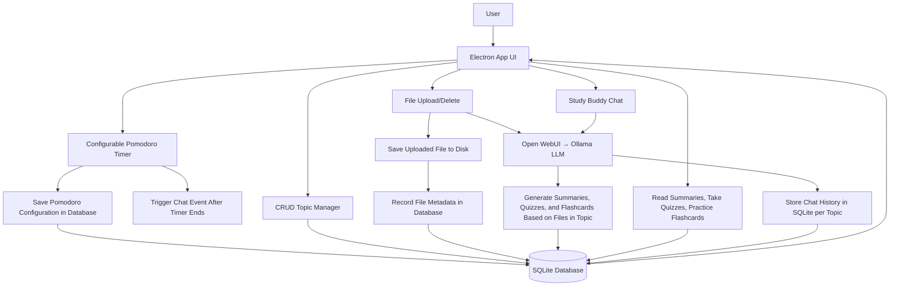
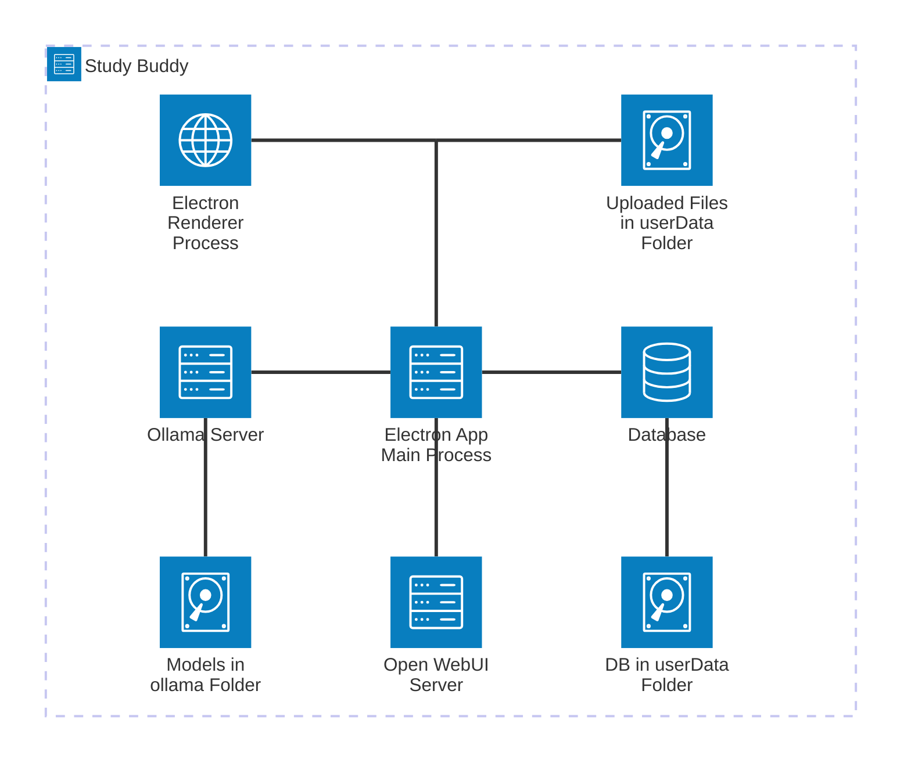
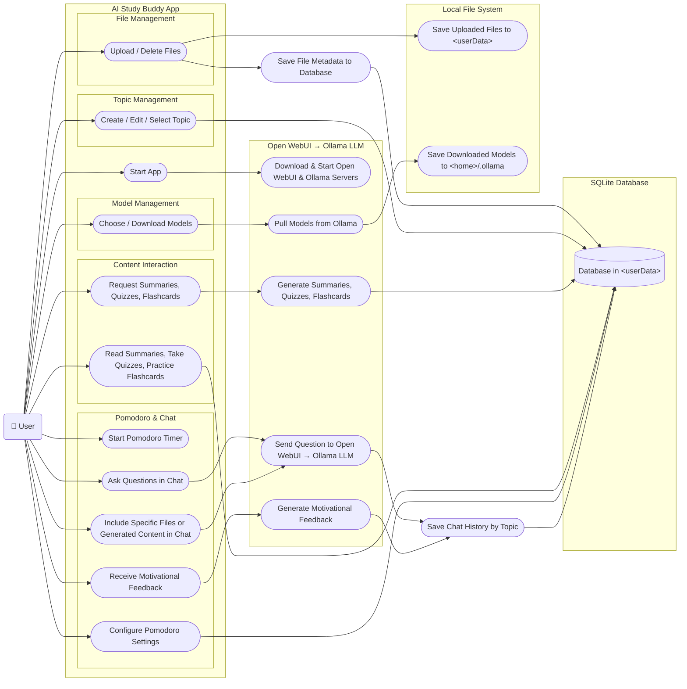

# AI-Study-Buddy

## Recommended IDE Setup

- [VSCode](https://code.visualstudio.com/) + [ESLint](https://marketplace.visualstudio.com/items?itemName=dbaeumer.vscode-eslint) + [Svelte](https://marketplace.visualstudio.com/items?itemName=svelte.svelte-vscode)

## Project Setup

### Install

1. Install [Node.js](https://nodejs.org/)
2. Install [Python](https://www.python.org/)
3. In the project directory, run `npm install`

### Development

```bash
$ npm run dev
$ # or to test building
$ npm run start
```

This app is built with `electron-vite`. Vite acts as the build tool bundling the renderer up and provides hot reloading.
Electron is the framework that is used to make desktop apps with JS (Node.js). Electron architecture is split into 3 main components:
the main process, one or more renderer processes, and preload scripts. 

The main process acts as the app's backend. it manages the app's windows and the application's lifecycle. It runs in a Node.js environment so it has access to the OS's apis and file system.

The renderer processes hold the app's frontend logic and are responsible for displaying (rendering) stuff to the user. 

If you want to communicate between the main process and a renderer process, you'll need to expose dev-defined apis to the renderer. You do this in the preload scripts.

With this in mind, if you want to expose new functionality to the frontend, you will need to create the functionality in the main folder (most likely `main/index.js`), expose that as an api endpoint in the preload folder (`preload/index.js`), and then use it in the renderer folder (`renderer/src/App.svelte` or `renderer/src/components/<your_component>.svelte`).

For example we have this IPC (Inter-Process Communication) listener in the main process:

```js
ipcMain.handle('get-topics', async () => {
  try {
    const topics = await db.getTopics();
    return topics;
  } catch (err) {
    throw new Error(err.message);
  }
});
```
notice, we use ipcMain.handle and give it a name and function to execute when the listener is triggered.

In `preload/index.js` we expose it to the renderer processes:

```js
const api = {
  ...,

  getTopics: async () => {
    return await electronAPI.ipcRenderer.invoke('get-topics')
  },
}

...

contextBridge.exposeInMainWorld('api', api)
```
we then use this endpoint in `renderer/src/components/TopicManager.svelte`:
```html
<script>
  ...

  async function fetchTopics() {
    topics = await window.api.getTopics();
  }
</script>
```

The renderer is basically just rendering a webpage, so any HTML/CSS/JS should work. However, we are using Svelte (some files in V4, some in V5. see [migration guide](https://svelte.dev/docs/svelte/v5-migration-guide) for the differences) as our frontend framework, so it'll be easier if you learn that as you go. Try to organize things into components that you can reuse and place in different places.

### Build

```bash
# For windows
$ npm run build:win

# For macOS
$ npm run build:mac

# For Linux
$ npm run build:linux
```

## Architecture

### Backend

#### App

This is a desktop app built in [Electron](https://www.electronjs.org/) (Node.js).

#### AI

* The app downloads and runs an [Ollama](https://ollama.com/) server to handle LLM tasks and chat
* It also runs the Python library [Open WebUI](https://openwebui.com/) for a Retrieval-Augmented Generation (RAG) pipeline API. This handles uploaded file OCR, vectorizing, indexing, and offers it to the LLM for retrieval

### Frontend

The frontend of this desktop app is built on [Svelte](https://svelte.dev/) V4 and V5 and uses [Svelte Material UI](https://sveltematerialui.com/) as its [Material Design](https://m3.material.io/) component library

### Database

The database is a simple [SQLite](https://sqlite.org/) database as we don't need anything large or powerful since each user has their own copy of the app and database

## Diagrams







## WishListed Features

* [ ] Summary improvements
  * [ ] Outline
  * [ ] Concept Explanations
* [ ] Quiz improvements
  * [ ] Difficulty chooser
  * [ ] Answer Explanations
* [ ] Exportable quizzes and flashcards to Quizlet
* [ ] Chat improvements
  * [ ] Suggest breaks (can just trigger on Pomodoro long break)
  * [ ] Give productivity tips
  * [ ] Customizable tone
* [ ] Gamify
  * [ ] Track Pomodoro stats (time spent, sessions finished)
  * [ ] Track Quiz / Flashcard stats like questions/cards finished, answers correct, correct streak
  * [ ] Overall points / lvl
  * [ ] Topic points / lvl
  * [ ] Achievements
* [ ] Highlight, add comments, ask questions about summary