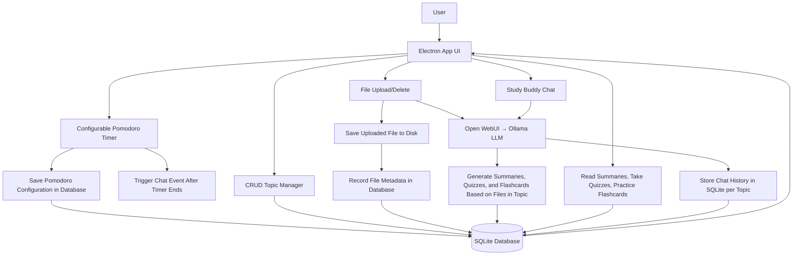
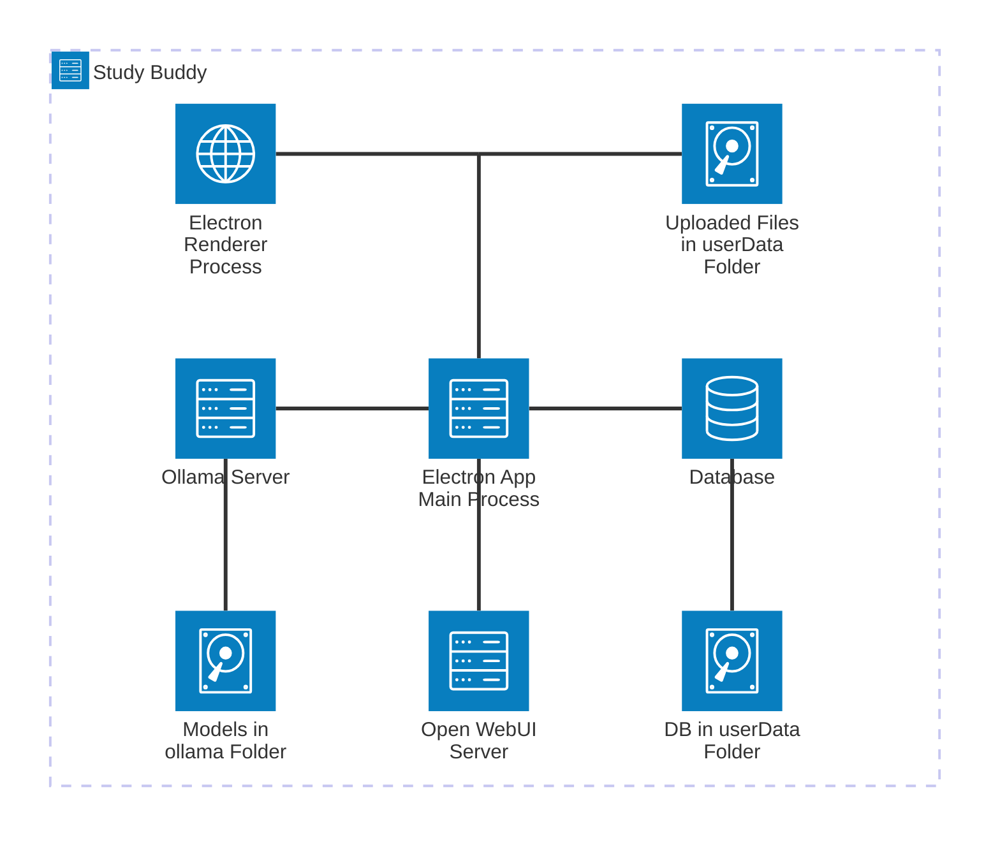
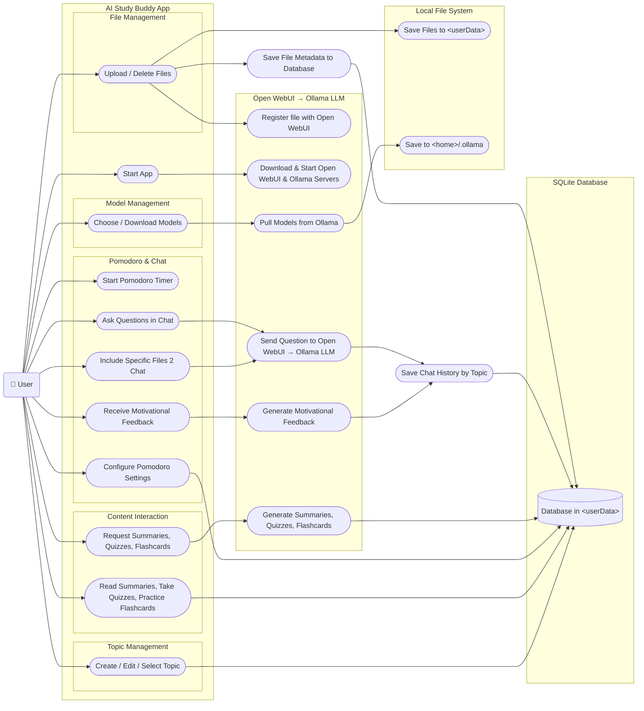
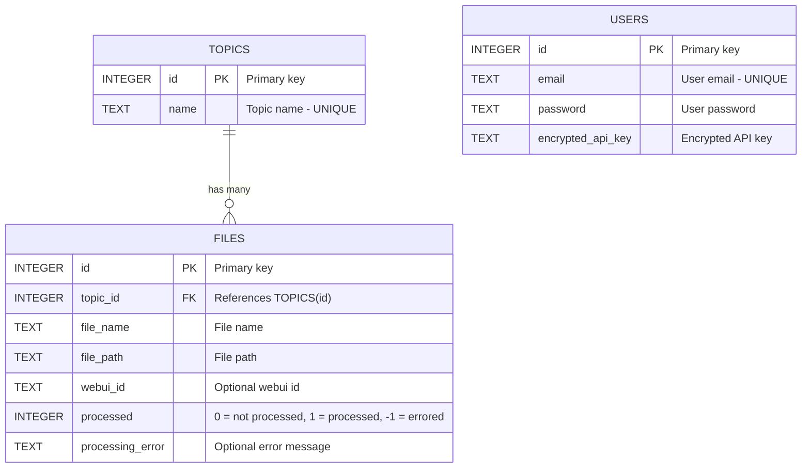

# AI-Study-Buddy

## Running releases

1. Install [Python 3.11 or 3.12](https://www.python.org/downloads/latest/python3.12/)
2. Download the relevant release from the [releases page](https://github.com/Chovin/AI-Study-Buddy/releases)
3. Open the app
4. Allow the app time to download Ollama and Open WebUI
5. Allow the app time to download its first model
6. It is recommended to also download and use at least llama3.2:3b as smaller models generate lower quality content, although be aware that larger models require much more memory and may slow down or freeze your computer
7. Create topics, upload files, and generate study materials

### FAQ

1. If you are on a Mac and are getting `“ai-study-buddy” is damaged and can’t be opened. You should move it to the Trash.`, this is likely because we published this without an Apple Developer account ($99/year) so Apple doesn't recognize it as a properly signed app. To work around this, open a terminal and run `xattr -cr <path_to_app>/ai-study-buddy.app`, replacing `<path_to_app>` with the path to the app on your computer. for example if you put it into `/Applications/`, then you would run `xattr -cr /Applications/ai-study-buddy.app`
2. If you get "Port 8080 is already in use" when the app is starting Open WebUI, you will need to close the program using that port. On Mac/Linux, you can open a terminal and type `lsof -i :8080`. This will list the processes currently using that port. Take note of the number in the `PID` column. This is the process id. Then kill that process by entering the command `kill <PID>` where `<PID>` is the number in the `PID` column. For instance if the `PID` is `79673`, then you would type `kill 79673`. On Windows you would open a cmd prompt and type `netstat -ano | findstr :8080` and then use `taskkill /PID <PID> /F` to kill the process.

## User Manual 
**When the application first launches, some features are temporarily unavailable while the system finishes initializing.**
  - The following tabs are disabled:  
    Quiz  
    Flashcards  
    Summary  
    Chat  
  - The Topics and Timer tabs remain available

### 1. Navigation and Side Bar
  #### 1.1 Navigation Bar
  - Select an AI model using the "Select Model" dropdown
  - Select a Topic using the "Select Topic" dropdown
  #### 1.3 Side Bar
  - The side bar can be collapsed or expanded using the button at the top
  - Tabs available:  
    - Topics  
    - Quiz  
    - Flashcards  
    - Summary  
    - Chat  
    - Timer
  
### 2. Topics Tab
  #### 2.1 Creating a Topic
  - Go to the Topics tab
  - Type a name in "Add New Topic"
  - Click the + button
  #### 2.2 Renaming / Deleting
  - Click the pencil icon to rename
  - Click the trash icon to delete
  #### 2.3 Selecting a Topic
  - Click on a topic in the list or Use the "Select Topic" drop down at the top
  #### 2.3 Uploading Files
  - Select a topic
  - Drag a file into the upload section or Browse for a file
  - Files will appear in the list

### 3. Quiz Tab
  #### 3.1 Generating Quiz
  - Select a difficulty (Easy, Medium, Hard)
  - Click "Generate Quiz"
  - Quiz will be created based on the selected topic and its files
  #### 3.2 Answering Questions
  - Each question contains multiple choice options
  - Click an answer to select it
  - After selecting:
      - The correct answer will be highlighted green
      - Incorrect selections will be highlighted red

### 4. Flashcards Tab
  #### 4.1 Generating Flashcards 
  - Select a difficulty (Easy, Medium, Hard)
  - Click "Generate Flashcards"
  - Flashcards will be created based on the selected topic and its files
  #### 4.2 Using Flashcards
  - Each flashcard has a front (question) and back (answer)
  - Click on the Card or the Flip button to flip it
  - Move through flashcards using the button controls (next/previous)
  #### 4.3 Exporting
  - Click “Copy to Clipboard” to copy all flashcards
  - You can paste them into tools like Quizlet

### 5. Summary Tab
  #### 5.1 Generating Content
  - Click Quick or Detailed Summary
  - Summary will be created based on the selected topic and its files

### 6. Chat Tab
  #### 6.1 Asking Questions
  - Type a question and press Enter
  - The AI responds based on the selected topic and files
  #### 6.2 Chat Features
  - Messages are saved in chat history
  - View previously generated Quizzes, Flashcards, and Summaries

### 7. Timer Tab/Floating Timer
  #### 7.1 Timer Tab
  -  start, stop, and reset controls
  #####   7.1.1 Timer
  - Set a countdown time
  - An alarm will play when time reaches 0
  #####   7.1.2 Pomodoro
  - Uses a study and break cycle
  - set a Session and Break length
  - Automatically switches between work time and break time
  - An alarm will play when time reaches 0
  #####  7.1.3 Stopwatch  
  - Counts time upward
  #### 7.2 Floating Timer
  - A small timer appears on screen while using other tabs
  - Hover over the timer to view start/pause or reset buttons
  - Drag timer up or down to change position


## Recommended IDE Setup

- [VSCode](https://code.visualstudio.com/) + [ESLint](https://marketplace.visualstudio.com/items?itemName=dbaeumer.vscode-eslint) + [Svelte](https://marketplace.visualstudio.com/items?itemName=svelte.svelte-vscode)

## Project Setup

### Install

1. Install [Node.js](https://nodejs.org/)
2. Install [Python 3.11 or 3.12](https://www.python.org/downloads/latest/python3.12/)
3. In the project directory, run `npm install`

### Development

```bash
$ npm run dev
$ # or to test frontend renderer stuff only
$ npm run start
$ # use this to delete databases for recreation. 
$ # useful if db schema changes or can't login to Open WebUI
$ npm run clear-databases
```

This app is built with `electron-vite`. Vite acts as the build tool bundling the renderer up and provides hot reloading.
Electron is the framework that is used to make desktop apps with JS (Node.js). Electron architecture is split into 3 main components:
the main process, one or more renderer processes, and preload scripts. 

The main process acts as the app's backend. it manages the app's windows and the application's lifecycle. It runs in a Node.js environment so it has access to the OS's apis and file system.

The renderer processes hold the app's frontend logic and are responsible for displaying (rendering) stuff to the user. 

If you want to communicate between the main process and a renderer process, you'll need to expose dev-defined apis to the renderer. You do this in the preload scripts.

With this in mind, if you want to expose new functionality to the frontend, you will need to create the functionality in the main folder (most likely `main/index.js`), expose that as an api endpoint in the preload folder (`preload/index.js`), and then use it in the renderer folder (`renderer/src/App.svelte` or `renderer/src/components/<your_component>.svelte`).

For example we have this IPC (Inter-Process Communication) listener in the main process:

```js
ipcMain.handle('get-topics', async () => {
  try {
    const topics = await db.getTopics();
    return topics;
  } catch (err) {
    throw new Error(err.message);
  }
});
```
notice, we use ipcMain.handle and give it a name and function to execute when the listener is triggered.

In `preload/index.js` we expose it to the renderer processes:

```js
const api = {
  ...,

  getTopics: async () => {
    return await electronAPI.ipcRenderer.invoke('get-topics')
  },
}

...

contextBridge.exposeInMainWorld('api', api)
```
we then use this endpoint in `renderer/src/components/TopicManager.svelte`:
```html
<script>
  ...

  async function fetchTopics() {
    topics = await window.api.getTopics();
  }
</script>
```

The renderer is basically just rendering a webpage, so any HTML/CSS/JS should work. However, we are using Svelte (some files in V4, some in V5. see [migration guide](https://svelte.dev/docs/svelte/v5-migration-guide) for the differences) as our frontend framework, so it'll be easier if you learn that as you go. Try to organize things into components that you can reuse and place in different places.

### Build

```bash
# For windows
$ npm run build:win

# For macOS
$ npm run build:mac

# For Linux
$ npm run build:linux
```

the executable will appear in the `dist` folder. 

#### Troubleshooting

If the app doesn't pop up when you open it, you may need to close it and reopen it again. Not sure why
Potentially, this might just be a Mac thing and is happening because we didn't sign the app yet. If the app still doesn't open, try opening it from the terminal `./dist/mac-arm64/ai-study-buddy.app/Contents/MacOS/ai-study-buddy`. Future attempts to open it by double clicking on the app should open it now.

You might need to remove the `dist` and `out` folders first before you rebuild.

## Architecture

### Backend

#### App

This is a desktop app built in [Electron](https://www.electronjs.org/) (Node.js).

#### AI

* The app downloads and runs an [Ollama](https://ollama.com/) server to handle LLM tasks and chat
* It also runs the Python library [Open WebUI](https://openwebui.com/) for a Retrieval-Augmented Generation (RAG) pipeline API. This handles uploaded file OCR, vectorizing, indexing, and offers it to the LLM for retrieval

### Frontend

The frontend of this desktop app is built on [Svelte](https://svelte.dev/) V4 and V5 and uses [Svelte Material UI](https://sveltematerialui.com/) as its [Material Design](https://m3.material.io/) component library

### Database

The database is a simple [SQLite](https://sqlite.org/) database as we don't need anything large or powerful since each user has their own copy of the app and database

## Diagrams









## WishListed Features

* [ ] Summary improvements
  * [ ] Outline
  * [ ] Concept Explanations
* [ ] Quiz improvements
  * [ ] Difficulty chooser
  * [ ] Answer Explanations
* [ ] Exportable quizzes and flashcards to Quizlet
* [ ] Chat improvements
  * [ ] Suggest breaks (can just trigger on Pomodoro long break)
  * [ ] Give productivity tips
  * [ ] Customizable tone
* [ ] Gamify
  * [ ] Track Pomodoro stats (time spent, sessions finished)
  * [ ] Track Quiz / Flashcard stats like questions/cards finished, answers correct, correct streak
  * [ ] Overall points / lvl
  * [ ] Topic points / lvl
  * [ ] Achievements
* [ ] Highlight, add comments, ask questions about summary